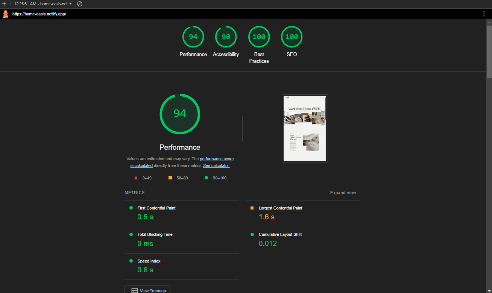
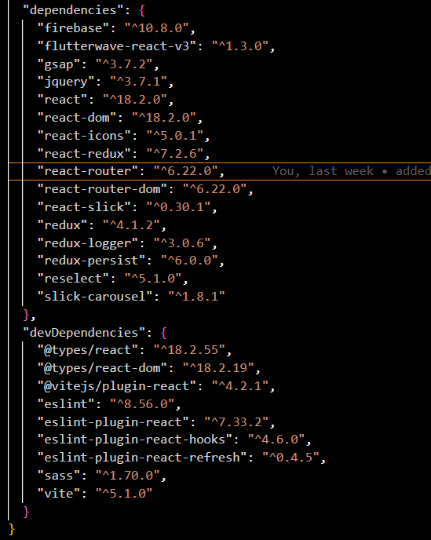
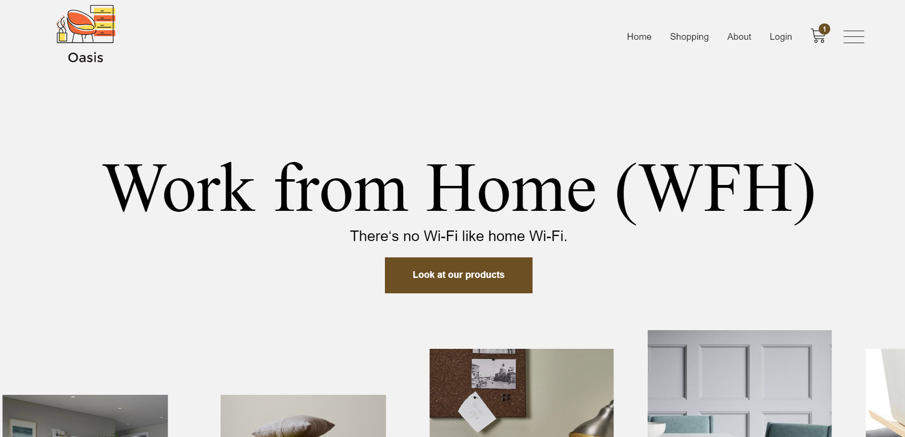
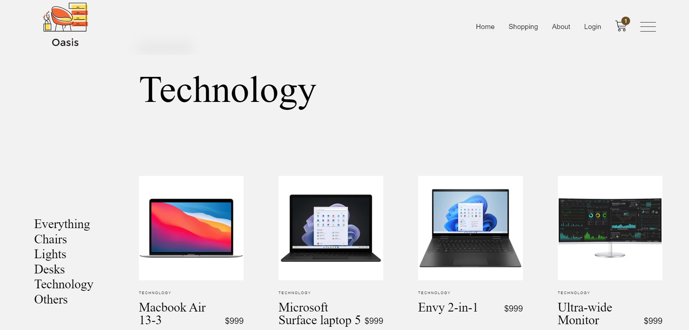
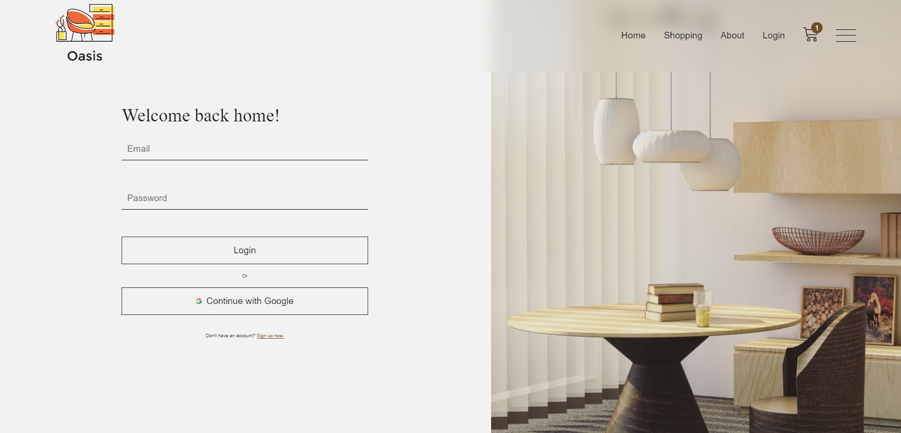
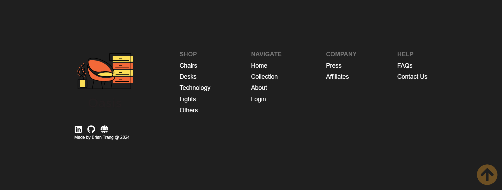

# WFH-Oasis

https://home-oasis.netlify.app  

## 📄 Description 

Oasis is an E-commerce React web application tailored to transform your living space into a productive workspace and vice versa. Seamlessly blending functionality with style, Oasis leverages Firebase for authentication, Redux for state management, and Stripe for secure payment processing. With Vite ensuring efficient bundling and SASS providing sleek aesthetics, Oasis offers an intuitive user experience. Deployed on Netlify, Oasis guarantees seamless accessibility, allowing users to explore our curated selection of furniture, decor, and accessories from anywhere, anytime


[](https://app.netlify.com/sites/home-oasis/deploys)


## 📓 Table of Contents
- [WFH-Oasis](#wfh-oasis)
  - [📄 Description](#-description)
  - [📓 Table of Contents](#-table-of-contents)
  - [💡🏡 Lighthouse](#-lighthouse)
  - [🪛 Technologies used](#-technologies-used)
  - [🖥️ Installation](#️-installation)
  - [💬 Usage](#-usage)
  - [🖼️ Screenshot](#️-screenshot)
  - [📹 Video](#-video)
  - [⚖️ License](#️-license)
  - [🤝 Contributing](#-contributing)
  - [🛠️ Tests](#️-tests)
  - [❔ Questions](#-questions)

## 💡🏡 Lighthouse
This is the Lighthouse Google report showcasing Performance 🚀, Accessibility ♿️, Best practices ✅, and SEO 🔍.




## 🪛 Technologies used 

| Technology                | Description                               | Link                                                    |
|---------------------------|-------------------------------------------|---------------------------------------------------------|
| Firebase                  | Development platform                       | [Firebase](https://firebase.google.com/)                |
| Flutterwave React V3      | React library for Flutterwave integration | [Flutterwave React V3](https://github.com/Flutterwave/react-v3) |
| GSAP                      | Animation library                         | [GSAP](https://greensock.com/gsap/)                     |
| jQuery                    | JavaScript library                        | [jQuery](https://jquery.com/)                           |
| React                     | JavaScript library for building UIs       | [React](https://reactjs.org/)                          |
| React DOM                 | React rendering for the DOM               | [React DOM](https://reactjs.org/)                      |
| React Icons               | SVG icon library for React                | [React Icons](https://react-icons.github.io/react-icons/) |
| React Redux               | State management library for React        | [React Redux](https://react-redux.js.org/)              |
| React Router              | Routing library for React                  | [React Router](https://reactrouter.com/)                |
| React Router DOM          | React Router for the DOM                  | [React Router DOM](https://reactrouter.com/web/guides/quick-start) |
| React Slick               | Carousel component for React              | [React Slick](https://react-slick.neostack.com/)        |
| Redux                     | State container for JavaScript apps       | [Redux](https://redux.js.org/)                          |
| Redux Logger              | Logger middleware for Redux               | [Redux Logger](https://github.com/LogRocket/redux-logger) |
| Redux Persist             | State persistence for Redux               | [Redux Persist](https://github.com/rt2zz/redux-persist) |
| Reselect                  | Selector library for Redux                | [Reselect](https://github.com/reduxjs/reselect)         |
| Slick Carousel            | Carousel component for websites           | [Slick Carousel](https://kenwheeler.github.io/slick/)   |
| Types React               | TypeScript types for React                | [Types React](https://github.com/DefinitelyTyped/DefinitelyTyped) |
| Types React DOM           | TypeScript types for React DOM            | [Types React DOM](https://github.com/DefinitelyTyped/DefinitelyTyped) |
| Vite                      | Frontend build tool                       | [Vite](https://vitejs.dev/)                             |
| @vitejs/plugin-react      | Vite plugin for React                     | [Vite (Plugin React)](https://github.com/vitejs/vite)  |
| ESLint                    | JavaScript linter                         | [ESLint](https://eslint.org/)                          |
| eslint-plugin-react       | ESLint plugin for React                   | [ESLint Plugin React](https://eslint.org/)             |
| eslint-plugin-react-hooks | ESLint plugin for React Hooks             | [ESLint Plugin React Hooks](https://www.npmjs.com/package/eslint-plugin-react-hooks) |
| eslint-plugin-react-refresh | ESLint plugin for React Refresh         | [ESLint Plugin React Refresh](https://www.npmjs.com/package/eslint-plugin-react-refresh) |
| Sass                      | CSS extension language                    | [Sass](https://sass-lang.com/)                          |
| Vite                    | Frontend build tool                   | [Vite](https://vitejs.dev/)               |
| Stripe                  | Payment processing platform           | [Stripe](https://stripe.com/)             |
| Netlify                 | Web hosting and automation platform  | [Netlify](https://www.netlify.com/)       |

    
## 🖥️ Installation 
Users can clone the code and run npm install to install the dependencies
```pip
 npm install 
```

Afterwards users can run the command ```npm run build``` which will run the Vite build process which will bundle the React source code
```pip
npm run build
```

Afterwards users can run the command ```npm run dev``` which will executes the vite command, which starts the development server provided by Vite  
and allows users to run the code on their local host
```pip
npm run dev
```
This sequence ensures that your client-side code is built before starting the server.

  

Package.json dependencies ⚙️  



## 💬 Usage 
Have fun!


## 🖼️ Screenshot

Homepage


Shopping


Login


Footer


## 📹 Video
GIF showing Homepage, adding a item to the cart and scroll button

  
## ⚖️ License 
This project is licensed under MIT
  
## 🤝 Contributing 
N/A
  
## 🛠️ Tests
N/A
 
## ❔ Questions
If you have any questions about this project, please contact me directly at brian.trang9@gmail.com. Feel free to view more of my projects at https://github.com/Makeredundant.